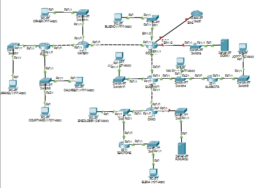
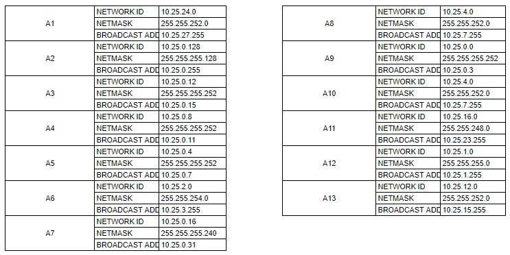
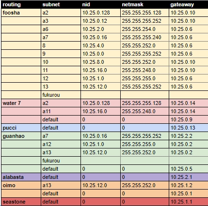
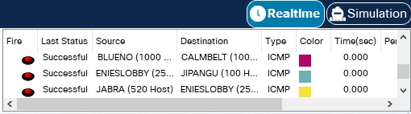

# JARKOM-MODUL-4-D08-2021
- 05111940000233 Aristya Vika Wijaya
- 05111940000199	Aprilia Annisa Suryo
- 05111940000188	Riki Wahyu Nur Dianto

## VLSM ( Variable Length Subnet Masking) - CPT

### Subnetting Pada Topologi
Berikut merupakan hasil subnetting pada topologi soal


Berikut Merupakan Jumlah IP dan Netmask yang Didapat

| Subnet | Jumlah IP  | Netmask  |
| :-----: | :-: | :-: |
| A1 | 1001 | /22 |
| A2 | 101 | /25 |
| A3 | 2 | /30 |
| A4 | 2 | /30 |
| A5 | 2 | /30 |
| A6 | 502 | /23 |
| A7 | 13 | /28 |
| A8 | 521 | /22 |
| A9 | 2 | /30 |
| A10 | 701 | /22 |
| A11 | 2021 | /21 |
| A12 | 252 | /24 |
| A13 | 721 | /22 |
| Total | 5841 | /19 |

Perhitungan Alamat IP berdasarkan NID dan juga Netmask Menggunakan TREE Sebagai Berikut:


### Praktik pada CPT
Pertama yang perlu dilakukan adalah membuat topologi seperti di soal.


Setalah itu mengatur IP untuk masing-masing interface yang ada di setiap device sesuai dengan pembagian subnet pada pohon VLSM. Dan tidak lupa port status dalam status `ON`.


Melakukan routing pada setiap Router.



**1.Foosha**
``` bash
    10.25.8.0/22 via 10.25.0.10
    10.25.0.128/25 via 10.25.0.10
    10.25.0.12/30 via 10.25.0.10
    10.25.2.0/23 via 10.25.0.6
    10.25.0.16/28 via 10.25.0.6
    10.25.4.0/22 via 10.25.0.6
    10.25.0.0/30 via 10.25.0.6
    10.25.16.0/21 via 10.25.0.10
    10.25.1.0/24 via 10.25.0.6
    10.25.12.0/30 via 10.25.0.6
```

**2.Water 7**
``` bash
  0.0.0.0/0 via 10.25.0.9
  10.25.0.128/25 via 10.25.0.14
  10.25.16.0/21 via 10.25.0.14
```

**3.Pucci**
``` bash
0.0.0.0/0 via 10.25.0.13
```

**4.Guanhao**
``` bash
10.25.1.0/24 via 10.25.0.2
10.25.12.0/22 via 10.25.0.2
0.0.0.0/0 via 10.25.0.5
10.25.0.16/30 via 10.25.2.2
```

**5.Alabasta**
``` bash
0.0.0.0/0 via 10.25.2.1
```

**6.Oimo**
``` bash
10.25.12.0/22 via 10.25.1.2
0.0.0.0/0 via 10.25.0.1
```

**7.Seastone**
``` bash
0.0.0.0/0 via 10.25.1.1
```

Setelah itu dapat melakukan ping dengan `add simple pdu` pada router atau pc.

Jika berhasil akan muncul status succesfull.



## CIDR (Classless Inter Domain Routing)
